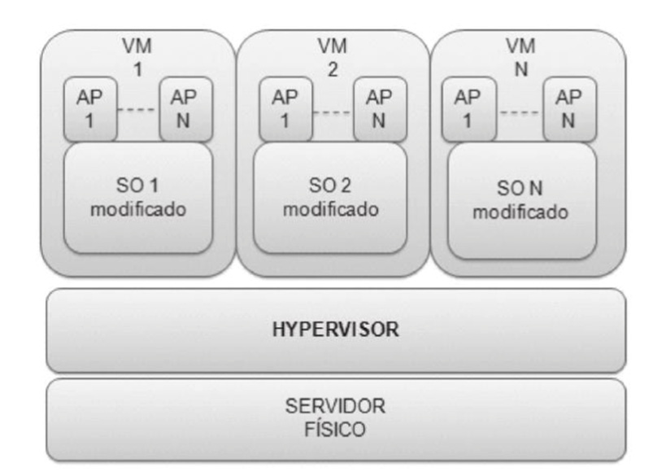

---

Questão 1

<!-- PC-PB 2021 - Cargo 7 Questão 52 -->

O esquema RAID que possui dois cálculos de paridade diferentes, executados e armazenados em blocos separados em discos distintos, e que necessita de D+2 discos, em que D é a quantidade de discos necessária para armazenar os dados do usuário, é o

- a. RAID 3.
- b. RAID 5.
- c. RAID 0.
- d. RAID 6.
- e. RAID 1.

---

Questão 2

<!-- PC-PB 2021 - Cargo 2 Questão 54 -->

Na linguagem Python, o tipo de uma variável em tempo de execução é definido pelo interpretador pelo recurso denominado

- a. modo interativo.
- b. tipagem dinâmica.
- c. sintaxe.
- d. empacotamento.
- e. interpretação bytecode.

---

Questão 3

<!-- PC-PB 2021 - Cargo 7 Questão 62 -->

Julgue os itens subsequentes, relativos à ferramenta debugger, usada na engenharia reversa.

- i. Realiza a análise estática de um código binário.
- ii. Microsoft WinDBG, OllyDBG, IDA Pro, PyDBG e SoftIce são exemplos de debuggers para Windows.
- iii. Permite modificar o conteúdo de registradores e memória e, assim, altera a execução do programa.

Assinale a opção correta.

- a. Apenas os itens I e III estão certos.
- b. Todos os itens estão certos.
- c. Apenas os itens II e III estão certos.
- d. Apenas o item I está certo.
- e. Apenas o item II está certo.

---

Questão 4

<!-- PC-PB 2021 - Cargo 2 Questão 60 -->

No modelo TCP/IP para conexão inter-redes, a camada que garante a transferência de dados confiável é a camada

- a. de transporte.
- b. de aplicação.
- c. de Internet.
- d. de interface de rede.
- e. física.

---

Questão 5

<!-- PC-PB 2021 - Cargo 2 Questão 56 -->

Em banco de dados, para definir as operações básicas em uma tabela, utiliza-se o acrônimo

- a. DROP.
- b. CRUD.
- c. SQL.
- d. NoSQL.
- e. ODBC.

---

Questão 6

<!-- PC-PB 2021 - Cargo 7 Questão 65 -->

O nível de isolamento especificado pelo padrão SQL em que não é permitida leitura, atualização, inserção ou remoção de qualquer registro que está sendo lido, até que se encontre o commit ou rollback, é chamado de

- a. serializável.
- b. leitura repetitiva.
- c. escritas sujas.
- d. leitura confirmada.
- e. leitura não confirmada.

---

Questão 7

<!-- PC-PB 2021 - Cargo 7 Questão 73 -->

Nos sistemas iOS, o mecanismo de gerenciamento de memória responsável pela liberação do espaço de memória ocupado por objetos de dados descartados é denominado

- a. garbage collector.
- b. memory management unit.
- c. extended memory manager.
- d. automatic reference counting.
- e. smart drive.

---

Questão 8

<!-- PC-PB 2021 - Cargo 7 Questão 59 -->

Em desenvolvimento web, é comum a utilização de classes, tecnologias ou mesmo ferramentas e frameworks, como aquela que utiliza sua própria linguagem de consulta, o que facilita a etapa de desenvolvimento quanto ao acesso a bancos de dados e SQL. Esse exemplo enfatiza uma das vantagens do

- a. javaserver pages.
- b. javaserver faces.
- c. hibernate.
- d. servlet.
- e. asynchronous javascript and XML.

---

Questão 9

<!-- PC-PB 2021 - Cargo 7 Questão 56 -->

No sistema de arquivos NTFS, presente no Windows Server 2012 R2, o arquivo de sistema que possui pelo menos uma entrada para cada arquivo de um volume NTFS, inclusive a do próprio arquivo de sistema, e que guarda todas as informações sobre um arquivo, incluindo tamanho e permissões, é o

- a. master file table (MFT).
- b. secure - security file.
- c. extend - NTFS extension file.
- d. bitmap - cluster bitmap.
- e. volume boot record (VBR).

---

Questão 10

<!-- PC-PB 2021 - Cargo 7 Questão 74 -->

Nas redes sem fio, o EAP caracterizado por fornecer autenticação mútua e embasada em certificados digitais dispostos do lado do cliente e do lado do servidor é o do tipo

- a. FAST.
- b. TLS (transport layer security).
- c. SIM.
- d. AKA.
- e. TTLS (tunneled transport e security).

---

Questão 11

<!-- PC-PB 2021 - Cargo 7 Questão 64 -->

Na álgebra relacional, a operação que permite combinar informações de duas relações quaisquer é

- a. a seleção.
- b. a projeção.
- c. o produto cartesiano.
- d. a renomeação.
- e. a união.

---

Questão 12

<!-- PC-PB 2021 - Cargo 7 Questão 55 -->

O serviço no qual o provedor de nuvem fornece servidores, armazenamento, rede e ferramentas para desenvolver, testar, hospedar e entregar aplicativos e os clientes podem usar um conjunto de ferramentas pré-montadas é conhecido como

- a. Infrastructure as a Service (IaaS).
- b. Service as a Service (SaaS).
- c. Platform as a Service (PaaS).
- d. Function as a Service (FaaS).
- e. Containers as a Service (CaaS).

---

Questão 13

<!-- PC-PB 2021 - Cargo 7 Questão 54 -->

O tipo de virtualização antes ilustrado, em que a máquina virtual enxerga uma abstração do hardware não idêntica à do hardware físico, que requer modificação do sistema operacional convidado, é conhecido como

- a. virtualização assistida.
- b. virtualização embasada em translação binária.
- c. virtualização por hypervisor.
- d. paravirtualização.
- e. virtualização total.

---

Questão 14

<!-- PC-PB 2021 - Cargo 2 Questão 58 -->

O modelo de computação em nuvem que permite aos usuários finais acessar uma suíte de escritório na Web é denominado

- a. Virtual Machine (VM).
- b. Software as a Service (SaaS).
- c. Internet of Things (IoT).
- d. Platform as a Service (PaaS).
- e. Infrastructure as a Service (IaaS).

---

Questão 15

<!-- PC-PB 2021 - Cargo 2 Questão 64 -->

A coleta de dados que serão garimpados, na mineração de dados, é feita na etapa de

- a. aplicação.
- b. análise.
- c. preparação.
- d. priorização.
- e. mineração.

---

Questão 16

<!-- PC-PB 2021 - Cargo 7 Questão 58 -->

C# é uma linguagem de programação orientada a objetos que permite a criação de sistemas por meio de um código bem estruturado, a qual utiliza modificadores de acesso que descrevem o alcance da acessibilidade de um objeto e seus membros. O modificador cujo alcance da acessibilidade é limitado apenas dentro das classes ou estruturas em que é declarado é

- a. internal protected.
- b. private.
- c. internal.
- d. public.
- e. protected.

---

Questão 17

<!-- PC-PB 2021 - Cargo 2 Questão 63 -->

A capacidade de um agente computacional de alterar o próprio comportamento com base em situações anteriores é chamada de

- a. cooperatividade.
- b. proatividade.
- c. aprendizagem.
- d. autonomia.
- e. inteligência.

---

Questão 18

<!-- PC-PB 2021 - Cargo 2 Questão 66 -->

A rede de computadores que se caracteriza por permitir acesso restrito, comunicação instantânea, compartilhamento de dados e rede local é do tipo

- a. Internet.
- b. TCP/IP.
- c. OSI.
- d. extranet.
- e. intranet.

---

Questão 19

<!-- PC-PB 2021 - Cargo 7 Questão 66 -->

Técnica para se alcançar boa qualidade de serviço que utiliza um sistema de enfileiramento de um único servidor com tempo de serviço constante é

- a. armazenamento em buffers.
- b. algoritmo de balde furado.
- c. algoritmo de balde de símbolos.
- d. moldagem de tráfego.
- e. reserva de recursos.

---

Questão 20

<!-- PC-PB 2021 - Cargo 7 Questão 71 -->

A família de algoritmos SHA-2 é considerada um conjunto de funções de hash fortes porque, adicionalmente a outros requisitos, satisfaz especificamente o requisito de

- a. unidirecionalidade.
- b. tamanho de entrada variável.
- c. eficiência.
- d. pseudoaleatoriedade.
- e. forte resistência a colisões.

---

Questão 21

<!-- PC-PB 2021 - Cargo 7 Questão 67 -->

A camada do TCP/IP que permite que os dispositivos nos hosts de origem e de destino mantenham uma conversação é a

- a. de aplicação.
- b. de transporte.
- c. de enlace.
- d. inter-redes.
- e. de seção de rede.

---

Questão 22

<!-- PC-PB 2021 - Cargo 2 Questão 53 -->

Na Internet, o sítio que atua como ponto de contato entre uma instituição e seus clientes e fornecedores é o

- a. institucional.
- b. comunitário.
- c. portal.
- d. de informações.
- e. de aplicações.

---

Questão 23

<!-- PC-PB 2021 - Cargo 7 Questão 63 -->

A vista (view) de dicionário de dados da Oracle que se pode consultar para encontrar as colunas de chave primária de tabelas é

- a. DBA_TABLES.
- b. DBA_RULE.
- c. DBA_CONSTRAINTS.
- d. DBA_APPLY.
- e. DBA_SQLSET.

---

Questão 24

<!-- PC-PB 2021 - Cargo 7 Questão 70 -->

Entre as abordagens possíveis para atacar o algoritmo criptográfico RSA, aquela caracterizada por explorar as propriedades do próprio RSA é denominada ataque

- a. matemático.
- b. de temporização.
- c. de falhas de hardware.
- d. de força bruta.
- e. de textos cifrados escolhidos.

---

Questão 25

<!-- PC-PB 2021 - Cargo 2 Questão 59 -->

O vírus que permite mudar sua própria aparência e alterar padrões de comportamento é do tipo

- a. metamórfico.
- b. polimórfico.
- c. de disseminação ultrarrápida.
- d. veículo de transporte.
- e. multiexploração.

---

Questão 26

<!-- PC-PB 2021 - Cargo 7 Questão 60 -->

De forma genérica, um processo de engenharia reversa parte de um modelo de implementação e resulta em um modelo conceitual que descreve, de forma abstrata, a implementação em questão. Nesse contexto e considerando o caso de banco de dados, julgue os itens a seguir.

- i. A engenharia reversa de modelos relacionais é útil quando não se tem um modelo conceitual para um banco de dados existente.
- ii. O uso da engenharia reversa é útil quando o esquema do banco de dados sofre modificações ao longo do tempo, sem que elas tenham sido registradas no modelo conceitual.
- iii. Um caso específico de engenharia reversa de banco de dados é o da engenharia reversa de modelos relacionais, que tem como ponto de partida um modelo lógico de um banco de dados relacional e que tem como resultado um modelo conceitual.

Assinale a opção correta.

- a. Todos os itens estão certos.
- b. Apenas o item I está certo.
- c. Apenas os itens II e III estão certos.
- d. Apenas os itens I e III estão certos.
- e. Apenas o item II está certo.

---

Questão 27

<!-- PC-PB 2021 - Cargo 2 Questão 57 -->

Em organizações que tenham implantado big data, a gestão dos dados é de responsabilidade do

- a. CEO (Chief Executive Officer).
- b. CIO (Chief Information Officer).
- c. CISO (Chief Information Security Officer).
- d. CDO (Chief Data Officer).
- e. CFO (Chief Financial Officer).

---

Questão 28

<!-- PC-PB 2021 - Cargo 2 Questão 55 -->

No modelo de rede OSI, a camada responsável pelos protocolos utilizados pelos usuários é a camada de

- a. aplicação.
- b. apresentação.
- c. rede.
- d. sessão.
- e. transporte.

---

Questão 29

<!-- PC-PB 2021 - Cargo 7 Questão 69 -->

Nos sistemas criptográficos simétricos, o mecanismo que impede a criptoanálise por análise estatística caracterizado por dissipar a estrutura estatística do texto plano em estatísticas de longo alcance do texto cifrado é

- a. a substituição.
- b. a confusão.
- c. a permutação.
- d. o mapeamento.
- e. a difusão.

---

Questão 30

<!-- PC-PB 2021 - Cargo 7 Questão 61 -->

A engenharia reversa de arquivos maliciosos estuda o código suspeito para descobrir suas características e seu modo de ação. Uma das ferramentas utilizadas, nesse estudo, analisa o código de máquina (assembly) de um programa em execução mediante o exame de informações como execução de instrução a instrução, visualização de threads e criação de pontos de parada em posições do código. Essas funcionalidades integram a ferramenta de análise de código malicioso do tipo

- a. disassembler.
- b. manipulador de binários.
- c. decompilador.
- d. máquina virtual.
- e. debugger.

---

Questão 31

<!-- PC-PB 2021 - Cargo 2 Questão 64 -->

Em um banco de dados relacional, quando toda coluna não chave de uma tabela depende diretamente da chave primária diz-se que a tabela está, no mínimo, na

- a. segunda forma normal (2FN).
- b. primeira forma normal (1FN).
- c. terceira forma normal (3FN).
- d. quarta forma normal (4FN).
- e. quinta forma normal (5FN).

---

Questão 32

<!-- PC-PB 2021 - Cargo 7 Questão 72 -->

O sistema de segurança responsável por estabelecer uma conexão segura e criptografada entre o dispositivo de um usuário remoto e um servidor em alguma rede específica e por prover autenticidade, confidencialidade e integridade às comunicações dessa conexão é

- a. antivírus.
- b. VPN.
- c. IDS (intrusion detection system).
- d. NAT (network address translation).
- e. firewall.

---

Questão 33

<!-- PC-PB 2021 - Cargo 7 Questão 57 -->

Python é uma linguagem procedural que utiliza quatro tipos de dados predefinidos para lidar com coleções: conjuntos, dicionários, listas e tuplas. A respeito desses tipos de dados, julgue os itens a seguir.

- i. O conjunto permite o armazenamento de uma tupla, mas não o de uma lista.
- ii. A tupla é idêntica à lista, exceto pela forma mais simples com que sua declaração é realizada.
- iii. A lista é um tipo de dados variável que permite a alteração de seus elementos após a sua criação.

Assinale a opção correta.

- a. Apenas o item II está certo.
- b. Apenas o item I está certo.
- c. Apenas os itens I e III estão certos.
- d. Todos os itens estão certos.
- e. Apenas os itens II e III estão certos.

---

Questão 34

<!-- PC-PB 2021 - Cargo 7 Questão 68 -->

No frame relay, o identificador de circuito virtual é denominado

- a. circuit connection identifier.
- b. foward explicit congestion identifier.
- c. cell relay identifier.
- d. data link connection identifier.
- e. frame relay identifier.

---

Questão 35

<!-- PC-PB 2021 - Cargo 2 Questão 61 -->

Em arquivos do tipo texto, os metadados que permitem armazenar informações por meio de estruturas como XML ou JSON são do tipo

- a. categorizados.
- b. semiestruturados.
- c. hierárquicos.
- d. estruturados.
- e. não estruturados.

---

|       | Gabarito |       |
| :---: | :------: | :---: |
| 1 - Nulo | 2 - Nulo | 3 - Nulo |
| 4 - Nulo | 5 - Nulo | 6 - A |
| 7 - Nulo | 8 - Nulo | 9 - Nulo |
| 10 - Nulo | 11 - Nulo | 12 - Nulo |
| 13 - Nulo | 14 - Nulo | 15 - Nulo |
| 16 - Nulo | 17 - Nulo | 18 - Nulo |
| 19 - Nulo | 20 - Nulo | 21 - Nulo |
| 22 - Nulo | 23 - Nulo | 24 - Nulo |
| 25 - Nulo | 26 - Nulo | 27 - Nulo |
| 28 - Nulo | 29 - Nulo | 30 - Nulo |
| 31 - Nulo | 32 - Nulo | 33 - C |
| 34 - Nulo | 35 - Nulo |  |
